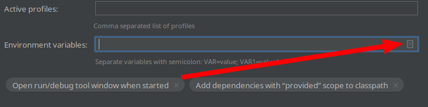

# Тестовое задание Back-End
## Данный проект написан при помощи Spring

### Установка и настройка
1. Установите Java 11+ и Docker
2. Клонируйте репозиторий
3. Добавьте переменные окружения из файла `.env` в Intellij IDEA
4. Поднимите контейнеры командой `docker-compose up -d`
5. Запустите класс `src/main/java/org/example/Lesha_REST/LeshaRestApplication.java`
    1. Аргументы запуска:
        - `--initdata data.json --log log.txt`
        - Где `data.json` это файл с начальными данными(формат данного файла описан ниже), а `log.txt` файл для записи логов
        - Также вы можете принудительно загрузить данные в БД с помощью флага `-force`(`--initdata data.json -force --log log.txt`), при этом данные не будут перезаписаны, а просто добавятся в существующим
    2. Нужные таблицы в БД создадутся автоматически
    3. Вы можете использовать pgAdmin для просмотра БД `http://127.0.0.1:5050`
        1. Для добавления сервера в pgAdmin введите следующие данные:
            - Хост: `postgres_container`
            - Порт `5432`
            - Имя пользователя и пароль можно посмотреть в файле `.env'
7. Используйте PostMan для тестирования API

### Не работает?
1. Убедитесь что вы настроили переменные окружения в Intellij IDEA для запуска и нужные порты(8080, 5432) не занимают другие программы.

## Формат начальных данных(data.json):
```json
{
  "account": {
    "money": 20000
  },
  "books": [
    {
      "author": "Стив Макконелл",
      "name": "Совершенный код",
      "price": 1000,
      "amount": 7
    },
    {
      "author": "Брюс Эккель",
      "name": "Философия Java",
      "price": 1500,
      "amount": 15
    },
    {
      "author": "Joshua Bloch",
      "name": "Effective Java",
      "price": 2500,
      "amount": 10
    }
  ]
}
```

## Сборка в .jar:
1. Добавьте переменные окружения из файла `.env` в Intellij IDEA
2. В запуск Maven добавьте `clean package -DskipTests`  


## Запуск .jar
`java -jar target/Lesha_REST-0.0.1-SNAPSHOT.jar`

## Как добавить переменные окружения в Intellij IDEA
1. Откройте файл `.env` и скопируйте его содержимое в буфер обмена
2. Нажмите `Edit Configuration` в меню запуска  
  
3. В открывшемся окне выберите нужную опцию для запуска и нажмите `Modify Options`  
  
4. В меню выберите `Environment variables`  
  
5. Появится новое поле для ввода, вставьте в него переменные из буфера обмена  
  
  
6. Сохраните переменные окружения
  
7. Сохраните изменения (Apply и затем Ok)  
  

### Тесты
Для их запуска выполните следующие действия:
1. Добавьте переменные окружения из файла `.env` в Intellij IDEA
2. В запуск Maven добавьте `clean test`
3. Запустите тесты
